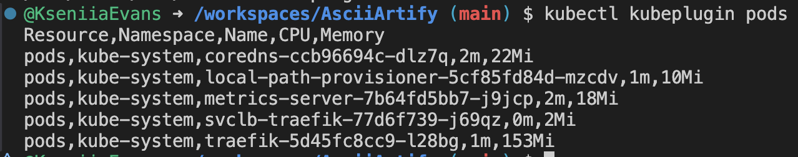
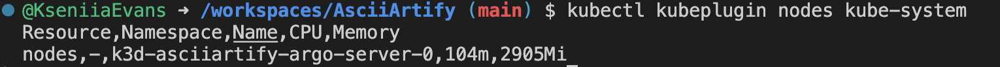

# Kubeplugin

## Overview

kubeplugin is a simple kubectl plugin written in Bash that retrieves CPU and memory usage statistics for Kubernetes resources and prints them in a clean CSV format.

The plugin uses kubectl top internally and supports both pods and nodes, making it easy to collect resource metrics from any cluster where Metrics Server is installed.

## Installation

Ensure the script is executable:
```
chmod +x scripts/kubeplugin
```

Install it as a kubectl plugin:

```
sudo cp scripts/kubeplugin /usr/local/bin/kubectl-kubeplugin
sudo chmod +x /usr/local/bin/kubectl-kubeplugin
```

Verify that kubectl detects the plugin:
```
kubectl plugin list
```

You should see:
```
/usr/local/bin/kubectl-kubeplugin
```

## Usage

### Basic syntax
```
kubectl kubeplugin <resource> [namespace]
```

### Supported resources

- pods
- nodes

### Examples
1. Get pod metrics from kube-system (default namespace)
kubectl kubeplugin pods



3. Get node metrics
kubectl kubeplugin nodes kube-system


